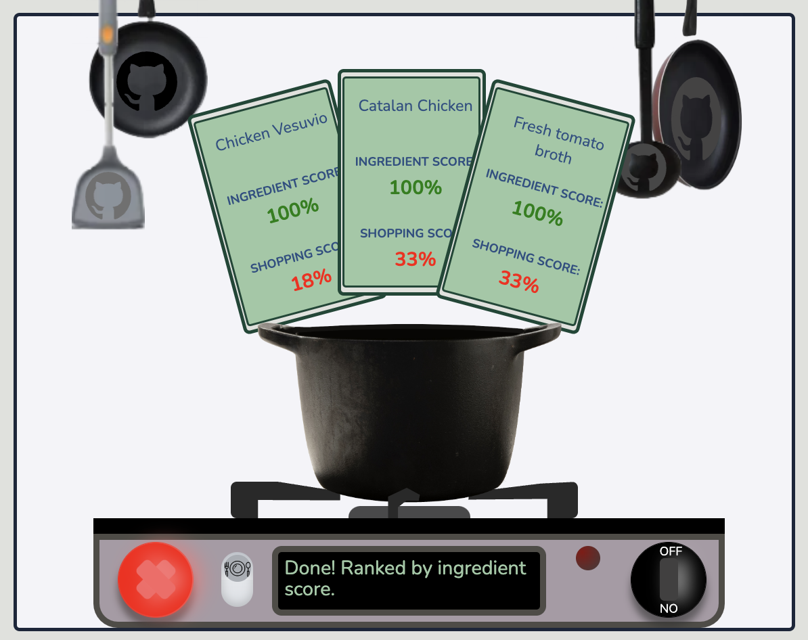
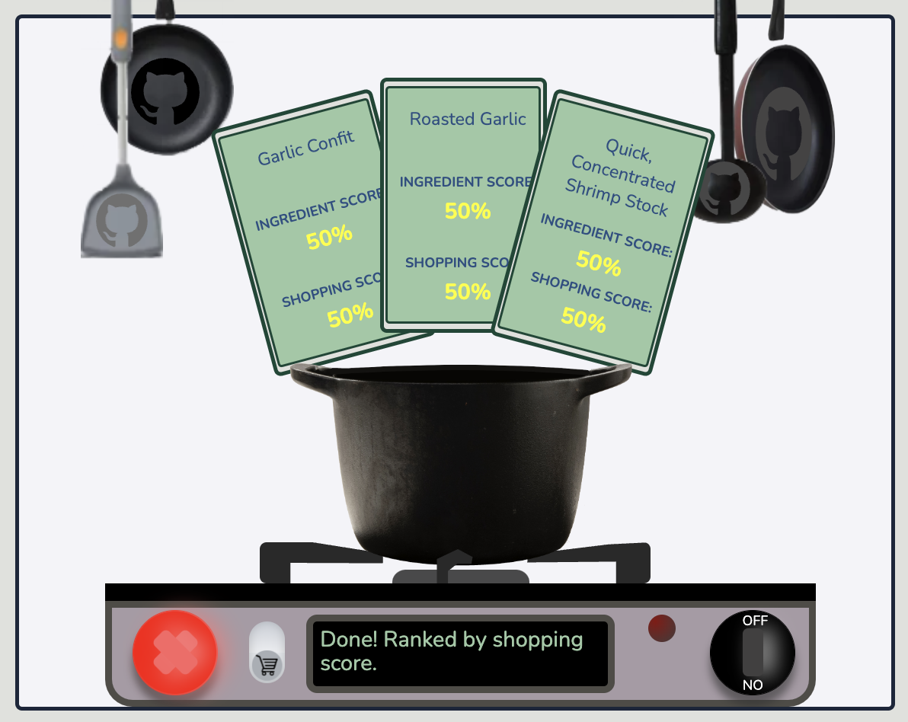

# Cubberd

## What is Cubberd?
Cubberd is an interactive app built on the MERNstack (MongoDB, Express, React.js, Node.js).
Users maintain a virtual Cubberd that represents what's in their actual cupboard at home. Users can add items from their Cubberd into the pot to search for recipes that use those specific ingredients. Cubberd does what other searches cannot, as it gives users the opportunity to add and remove certain ingredients and find recipes based on those preferences. 
Customers can save recipes to favorites or to planned depending (or both), as well as add ingredients to a shopping list and adjust the quantities on the shopping list.

## Technologies and Code Snippets
As backend lead, I built the Cubberd backend using MongoDb and Express. All recipe fetches hit the backend routes where the logic is stored that determines which recipes to return.
I wrote an algorithm takes the recipes in the fetch request and queries the database systematically for recipes containing every combination of ingredients in the request. The algorithm then scores the recipes in two ways. First is the ingredient score. The more ingredients in the original request used, the higher the score. Second is the shopping score. The fewer extra ingredients that aren't in a user's Cubberd, the higher the score. The code snippet below shows some of the scoring logic:
``` const getRecipes = async query => Recipe.find({"ingredients.food": {$all: query}})

const calculateShoppingScore = (cubberdArr, recipe) => {
    let shoppingScore;
    let numIngredientsinCubberd = 0;
    recipe.ingredients.forEach(ingredient => {
        if (cubberdArr.includes(ingredient.food)) {
            numIngredientsinCubberd += 1
        }
    })
    shoppingScore = Math.round((numIngredientsinCubberd / recipe.ingredients.length) * 100);
    return shoppingScore
}

router.post("/ingredients", async(req, res) => {
    const pot = req.body.pot
    const numQueryIngredients = pot.length;
    const cubberd = req.body.cubberd
        
    let potSubsets = []
    for (let i = 0; i < pot.length; i++) {
        for (let j = i + 1; j <= pot.length; j++) {
            let subset = pot.slice(i,j)
            potSubsets.push(subset)
        }
    }
    potSubsets.sort((a, b) => a.length > b.length ? -1 : 1);
    
    let recipesByIngredientScore = []
    let recipesByShoppingScore = []
    let recipesQuery = []
    let recipes = []
    for (let i = 0; i < potSubsets.length; i++) {
        let query = potSubsets[i]
        recipesQuery = await getRecipes(query)

        const ingredientScore = Math.round((query.length / numQueryIngredients) * 100)
        let shoppingScore;
        recipesQuery.forEach(recipe => {

            shoppingScore = calculateShoppingScore(cubberd, recipe)
            if (recipesByIngredientScore.length < 3) {
                if (!recipesByIngredientScore.some(bundle => bundle.recipe.url === recipe.url)) recipesByIngredientScore.push({"ingredientsScore": ingredientScore, "shoppingScore": shoppingScore, "recipe": recipe})
            }
            if (!recipesByShoppingScore.some(bundle => bundle.recipe.url === recipe.url)) recipesByShoppingScore.push({"ingredientsScore": ingredientScore, "shoppingScore": shoppingScore, "recipe": recipe})
        })
    }
    recipesByShoppingScore.sort((a, b) => a.shoppingScore > b.shoppingScore ? -1 : 1)
    recipes.push(recipesByIngredientScore, recipesByShoppingScore.slice(0,3))
    return res.json(recipes)
}) 
```

The screenshots below shows an example of the returned recipes:



